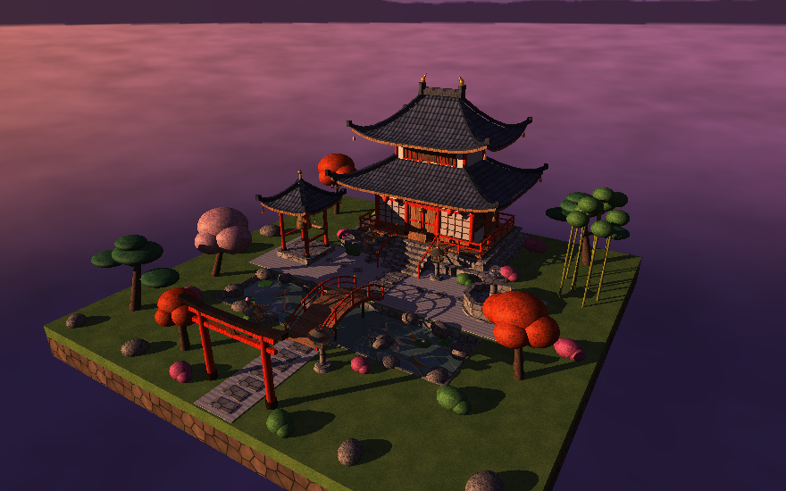
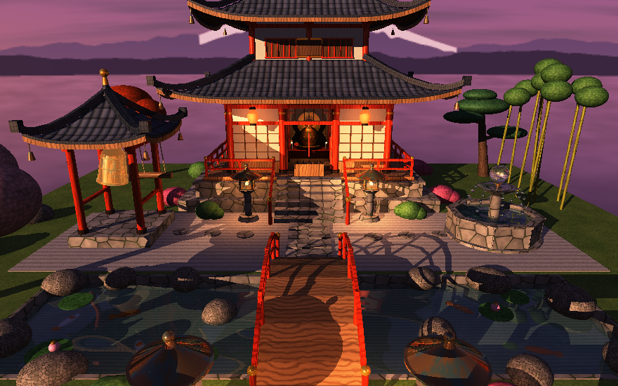
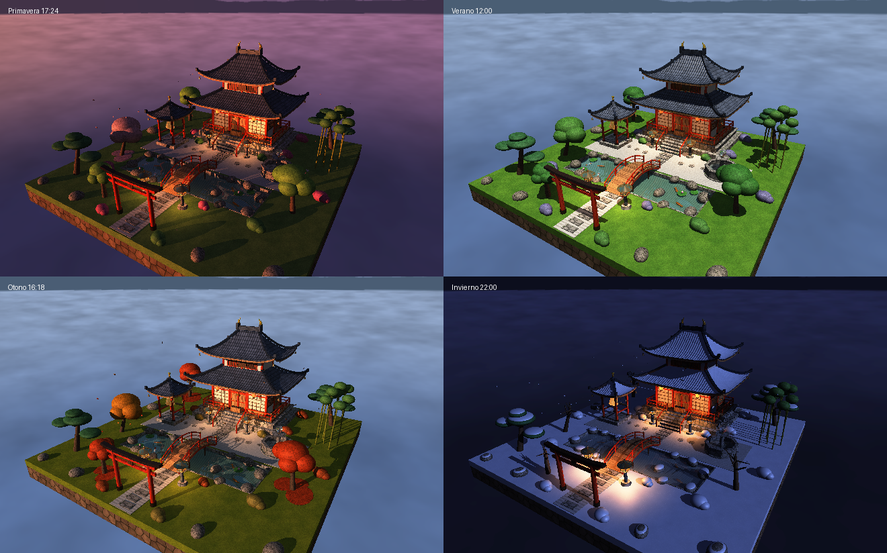
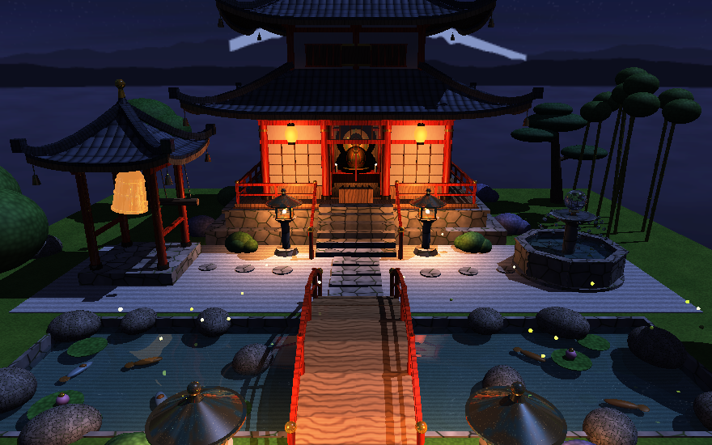
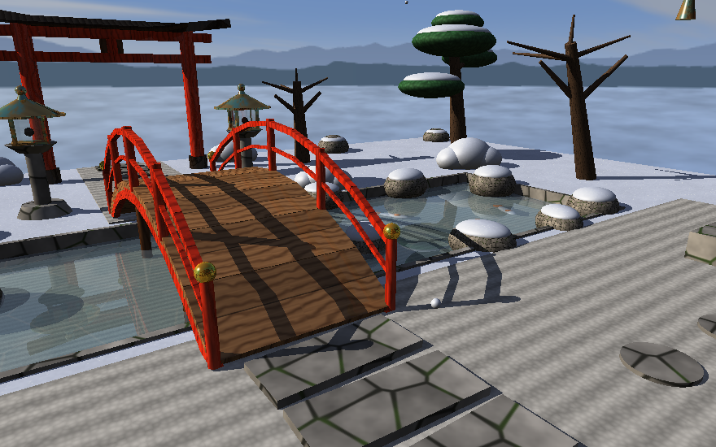
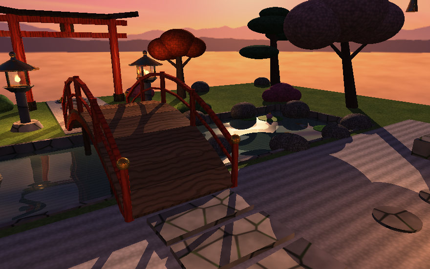
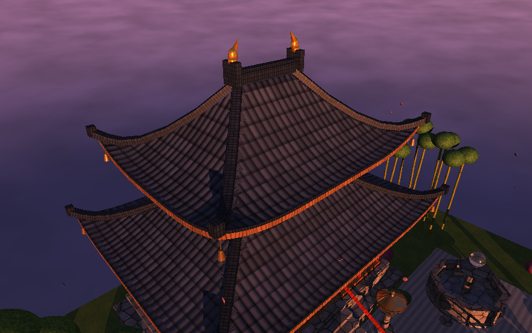

# Diorama interactivo: templo japonés con raytracing

Diorama 3D de un jardín japonés con un templo de dos niveles como punto
focal, con **ciclo de día y noche** y **las cuatro estaciones**,
renderizado **con un raytracer propio escrito en Rust**.
[raylib](https://www.raylib.com/) solo se usa para abrir la ventana, leer
el teclado/mouse, leer/guardar imágenes PNG y reproducir audio: la
intersección de rayos,
materiales, texturas, luces, sombras, reflexión, refracción y skybox
están implementados a mano.



## Video de demostración

> Coloca aquí el link del video de YouTube grabado para la entrega:

- **Video:** _(pendiente)_

## Cómo correrlo

```
cargo run --release
```

La primera vez se generan las texturas (`assets/textures`), los 4
skyboxes (`assets/skybox`) y los sonidos (`assets/sounds`) si no existen
(tarda unos 10 segundos). Para regenerarlos:

```
cargo run --release --bin generar_texturas
```

También hay un renderizador sin ventana, útil para sacar imágenes:

```
cargo run --release --bin captura -- <vista 1-5> <etapa 0-4> <ancho> <alto> <archivo.png> [estacion 0-3] [hora]
```

(`estacion`: 0 primavera, 1 verano, 2 otoño, 3 invierno; `hora` de 0 a 24.)

Y pruebas de la matemática (Snell, reflexión interna total, rotaciones),
de la progresión de interacciones y del recorrido del sol:

```
cargo test --release
```

### Notas de compilación en esta máquina

- `.cargo/config.toml` fija `LIBCLANG_PATH` a la instalación de MSYS2
  (bindgen de `raylib-sys` no la encuentra solo). En otra PC puede que
  haya que ajustar o borrar esa ruta.
- Compilar desde PowerShell o la terminal de VS Code. En *Git Bash* el
  `PATH` pone primero el MinGW de Git (`/mingw64/bin`), y el `gcc` de
  MSYS2 carga DLLs incompatibles y falla al compilar raylib.

## Controles

| Acción | Tecla / mouse |
|---|---|
| Rotar la cámara alrededor del diorama | flechas o arrastrar con clic izquierdo |
| Zoom | rueda del mouse o `+` / `-` |
| Mover el punto que mira la cámara | `W` `A` `S` `D` |
| Subir / bajar el punto que mira | `Q` / `Z` |
| Interactuar con el objeto bajo el mouse | clic izquierdo (sin arrastrar) |
| Interactuar con el objeto en el centro (mira) | `E` |
| Campana / linternas / fuente / puerta | `B` / `L` / `F` / `T` |
| Cambiar de estación | `C` |
| Pausar / reanudar el ciclo de día y noche | `N` |
| Atrasar / adelantar la hora (mantener) | `,` / `.` |
| Vistas predefinidas | `1` general, `2` templo, `3` estanque, `4` techo, `5` patio |
| Reiniciar cámara | `R` |
| Captura de pantalla (`captura.png`) | `P` |
| Mostrar/ocultar ayuda | `H` |

Al pasar el mouse sobre un objeto interactivo aparece su nombre.

## Interacciones

Todas las interacciones están disponibles desde el inicio y se pueden
usar en cualquier orden y las veces que se quiera.

| Interacción | Qué pasa |
|---|---|
| Campana | El mazo de madera se acerca y golpea; la campana oscila alrededor de su punto de suspensión (oscilación amortiguada) y el bronce brilla y se apaga de a poco. |
| Linternas | Las 4 linternas de piedra encienden su llama (material emisivo, visible refractada a través del vidrio) y las 2 linternas de papel del alero se iluminan. Cada una agrega una luz puntual cálida que ilumina el entorno. |
| Fuente | El nivel del agua sube, aparecen ondas circulares animadas (perturbación de la normal) y chorros de gotas que caen del cuenco superior. Con más agua se ven mejor las monedas refractadas en el fondo. |
| Puerta | Las dos hojas giran sobre sus bisagras hacia adentro y dejan ver el altar dorado iluminado por velas. |

### Sonidos

Cada interacción tiene su sonido (`src/sonido.rs`), reproducido con el
audio de raylib:

| Interacción | Sonido |
|---|---|
| Campana | campanada grave y larga de templo, con el golpe del mazo de madera |
| Linternas | clic del interruptor al encender y al apagar |
| Fuente | el agua arranca al activarla, corre en loop mientras la fuente tiene agua (más fuerte cuanto más llena) y se apaga de a poco al detenerla |
| Puerta | pestillo y crujido al abrir; arrastre y golpe al cerrar |

El sonido es **espacial**: el volumen baja con la distancia entre la
cámara y el objeto, y el paneo depende de si el objeto está a la
izquierda o a la derecha de la pantalla. Si la computadora no tiene
dispositivo de audio, el diorama funciona igual sin sonido.

Las linternas, la fuente y la puerta usan **grabaciones reales**
(originales en `sonidos/`), recortadas y normalizadas en
`assets/sounds/`:

- **Luz:** el archivo trae dos clics de interruptor; el primero es encender
  y el segundo apagar.
- **Fuente:** de 2 minutos de agua se sacaron el arranque, un loop de 6 s
  con el final fundido con el principio (para que no se note el corte) y
  el final apagándose.
- **Puerta:** apertura con pestillo y crujido; cierre con arrastre y golpe.

**Créditos:** las grabaciones son de
[Pixabay Sound Effects](https://pixabay.com/sound-effects/), bajo la
[Pixabay Content License](https://pixabay.com/service/license-summary/)
(uso gratuito, sin atribución obligatoria).

La **campana** es sintetizada (`src/generador_sonidos.rs`): parciales
inarmónicos que decaen, con pares apenas desafinados que producen la
pulsación típica, más el golpe del mazo. El programa solo sintetiza los
`.wav` que falten; para cambiar un sonido basta con reemplazar el archivo
con el mismo nombre.



## Estaciones y ciclo de día y noche



**Día y noche** (`src/ambiente.rs`). Con `N` el tiempo avanza (un día
dura 2 minutos) y con `,` / `.` se mueve la hora a mano. El HUD muestra la
estación y la hora.

- El **sol** recorre un arco real: sale detrás del templo (del lado del
  monte Fuji) a las 6:00, pasa por delante del templo al mediodía y se
  pone hacia la entrada del jardín a las 18:00. La **luna** va del lado
  opuesto.
- La luz principal es el sol de día y la luna de noche, con su color
  (blanco al mediodía, naranja al atardecer, azulado a la luz de luna) y
  sus sombras.
- Hay **4 skyboxes** (amanecer, día, atardecer y noche con estrellas y
  vía láctea) que se mezclan según la hora. El sol y la luna no están
  pintados en las imágenes: se dibujan al trazar, en su posición real,
  así también se reflejan en el agua.
- La luz ambiente y la exposición cambian con la hora; de noche lucen las
  linternas, el interior del templo detrás del papel shoji y las
  luciérnagas.

**Estaciones.** Con `C` se pasa a la siguiente; la escena se reconstruye
con la paleta de cada una:

| Estación | Cambios |
|---|---|
| Primavera | sakura en flor, arces verde claro, azaleas, pétalos que caen y alfombra de pétalos |
| Verano | follaje verde intenso, hortensias, pasto más verde, luciérnagas de noche |
| Otoño | arces rojos y sakura anaranjado, pasto seco, hojarasca en el suelo y hojas que caen |
| Invierno | nieve en techos, suelo, rocas y pinos; árboles sin hojas; estanque congelado (hielo que refleja y refracta); nieve que cae |

El sol sube más en verano que en invierno. Las partículas (pétalos, hojas,
copos, luciérnagas) se mueven mientras el tiempo avanza.





## Técnicas de raytracing

- **Un rayo por pixel** desde una cámara en perspectiva; se busca el
  impacto más cercano con una **BVH** (jerarquía de cajas envolventes)
  para que miles de triángulos del techo no hagan lento el render.
- **Primitivas**: caja (slab test), esfera/elipsoide, cilindro/tronco de
  cono (cuadrática + tapas) y triángulo (Möller–Trumbore). Cada objeto
  tiene posición, rotación y escala propias; el rayo se lleva a su
  espacio local para intersectarlo.
- **Iluminación**: ambiente de hemisferio + difusa (Lambert) + especular
  (Blinn-Phong), sol o luna como luz direccional con **rayos de sombra** (los objetos
  transparentes dejan pasar parte de la luz) y luces puntuales con radio
  de alcance.
- **Reflexión**: rayo secundario en la dirección `r = d - 2(d·n)n`.
  Los metales tiñen el reflejo con su color.
- **Refracción**: ley de Snell con **reflexión interna total**, reparto
  reflexión/refracción con **Fresnel (Schlick)** y **absorción de Beer**
  dentro del medio (le da al agua su color turquesa según la
  profundidad). Hasta 5 rebotes, cortando rayos que aportan menos de 2%.
- **Texturas**: PNG cargados desde `assets/textures`, con muestreo
  bilineal y repetición. Proyección por caja, cilíndrica o uv propias
  (techo).
- **Relieve**: perturbación de la normal para las tejas y para las
  ondas del agua (estanque y fuente).
- **Skybox**: 4 cubemaps de 6 imágenes (`assets/skybox/<momento>`) con
  nubes, estrellas, montañas y el monte Fuji detrás del templo, mezclados
  según la hora, más el sol y la luna dibujados en su dirección real (la
  misma que la de la luz principal).

### Materiales principales

Cada material tiene textura propia y parámetros propios (`src/material.rs`):

| Material | Textura | Albedo | Especular (brillo) | Reflectividad | Transparencia | IOR | Uso |
|---|---|---|---|---|---|---|---|
| **Madera** | `wood.png` | 1.0 | 0.25 (24) | 0.03 | 0 | – | pisos, puertas, paredes, puente |
| **Piedra** | `stone.png` | 1.0 | 0.05 (8) | 0.02 | 0 | – | base, escaleras, camino, linternas, fuente |
| **Metal (bronce)** | `metal.png` | 1.0 | 0.9 (90) | 0.45 | 0 | – | campana, techos de linternas, adornos |
| **Agua** | `water.png` | 1.0 | 0.9 (160) | 0.12 + Fresnel | 0.8 | 1.33 | estanque, fuente, gotas |
| **Vidrio** | `glass.png` | 1.0 | 1.0 (220) | 0.06 + Fresnel | 0.88 | 1.5 | ventanas, linternas, esfera de cristal |

Variantes de apoyo: laca bermellón y negra, madera oscura, oro, tejas
(`roof_tiles.png`), yeso y papel shoji translúcido (`paper.png`), pasto,
grava rastrillada, corteza, follaje (pino, arce, sakura, azalea,
hortensia), koi, llama emisiva, luciérnaga emisiva y, en invierno,
**nieve** (`snow.png`) y **hielo** (`ice.png`, transparencia 0.62, IOR 1.31).



## El templo

Salón de dos niveles construido en `src/escena/templo.rs` con funciones
reutilizables:

| Función | Contenido |
|---|---|
| `crear_base` | base de piedra de 2 escalones con cornisa |
| `crear_escaleras` | 6 escalones + pasamanos lacados con remates dorados |
| `crear_veranda` / `crear_barandales` | veranda de madera y barandal perimetral (postes + 2 travesaños) |
| `crear_columnas` | 12 columnas bermellón con base negra y anillo dorado |
| `crear_muros` | paneles shoji con celosía, travesaño de vidrio sobre la puerta, paredes de tablas |
| `crear_ventanas` | ventanas laterales de vidrio con marco y celosía |
| `crear_vigas` | vigas *nageshi* y *kashiragi* alrededor del salón |
| `crear_mensulas` | ménsulas *tokyō* sobre cada columna del borde y viga del alero |
| `crear_piso_superior` | segundo nivel con columnas, paredes de yeso y ventanas de celosía |
| `crear_techos` | techo de faldón + techo principal + frisos |
| `crear_decoraciones` | placa con marco dorado, caja de ofrendas, campanita con cuerda |
| `crear_altar` | altar con figura dorada, aureola y velas |
| `crear_puertas` | puerta doble con marco, clavos y tirador (animada) |

**Techos** (`src/escena/techo.rs`): superficie de triángulos cuya altura
sigue la curva cóncava japonesa (*sori*, `s^curva`), con el alero que se
levanta hacia las esquinas (*nokizori*). Encima: canto del alero (tejas
de borde + tabla de madera), limas diagonales en tramos que siguen la
curva, cumbrera con *onigawara* y *shachihoko* dorados, y campanitas
*fūrin* en cada esquina. La cara de abajo del techo usa madera. El mismo
generador arma el techo del campanario.



## Composición del jardín

```
            pino                          bambú
   arce             TEMPLO (+ altar)          pino
        linterna    escalera    linterna
  CAMPANARIO     patio de grava       FUENTE
  sakura  ~~~~~~~ PUENTE ARQUEADO ~~~~~~~  arce
          ~~~ ESTANQUE (koi, lotos) ~~~
        linterna     camino     linterna
                     TORII
```

El diorama es una isla flotante sobre un mar de nubes, con el templo al
fondo, el camino que lleva la mirada desde el torii, y el estanque con el
puente dando profundidad. La vegetación queda en los bordes.

## Rendimiento

- Render en paralelo por bloques de filas (`std::thread::scope`, sin
  crates extra).
- **Resolución progresiva**: 320×200 mientras la cámara se mueve o hay
  animaciones grandes, 512×320 mientras solo se anima el agua o avanza el
  ciclo de día y noche, y 880×550 cuando todo está quieto (se dibuja una
  vez y se reutiliza).
- La escena estática (~6500 primitivas, la mayoría triángulos del techo)
  se arma al arrancar y al cambiar de estación; en cada cambio de estado
  solo se reconstruye la parte dinámica (~80 a 140 objetos con las
  partículas).
- En un procesador de 12 hilos lógicos: ~110–330 ms la imagen en alta,
  y ~20–60 ms la previa (320×200).

## Estructura

```
src/
├── main.rs            ventana, input, render progresivo y HUD
├── lib.rs
├── matematica.rs      Vec3, Mat3, reflejar, refractar (Snell), Schlick
├── figuras.rs         Rayo, Aabb, primitivas e intersecciones
├── bvh.rs             BVH: impacto más cercano y rayos de sombra
├── material.rs        materiales
├── textura.rs         carga y muestreo de texturas
├── skybox.rs          cubemaps del cielo
├── ambiente.rs        estaciones, recorrido del sol, luz según la hora
├── camara.rs          cámara orbital, vistas predefinidas
├── render.rs          trazado recursivo, luces, reflexión, refracción
├── interaccion.rs     estado de las interacciones y animaciones
├── ruido.rs           ruido procedural (para generar assets)
├── generador.rs       genera texturas y skybox en PNG
├── generador_sonidos.rs  sintetiza los efectos de sonido en WAV
├── sonido.rs          reproduce los sonidos con volumen y paneo según la cámara
├── escena/
│   ├── mod.rs         escena estática + dinámica
│   ├── templo.rs      el templo
│   ├── techo.rs       generador de techos curvos
│   └── jardin.rs      terreno, estanque, puente, torii, campanario,
│                      fuente, linternas, vegetación, partículas
└── bin/
    ├── generar_texturas.rs
    └── captura.rs
assets/
├── textures/          wood, stone, metal, water, glass, roof_tiles,
│                      paper, leaves, grass, gravel, bark, snow, ice (.png)
├── skybox/            amanecer/, dia/, atardecer/, noche/
│                      cada una con px, nx, py, ny, pz, nz (.png)
└── sounds/            campana, linterna_encender, linterna_apagar,
                       fuente_activar, fuente_detener, fuente_agua,
                       puerta_abrir, puerta_cerrar (.wav)
```
